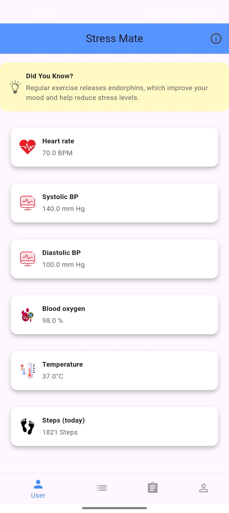

# StressMate - Mobile Application for Stress Detection

## Overview
StressMate is a mobile application designed to monitor and manage stress levels by collecting physiological data from wearables using the Google Fit API. The app tracks key metrics such as heart rate, heart rate variability (HRV), and sleep patterns, providing real-time stress feedback, summaries over different time periods, and actionable notifications to help manage stress.

## Features
- **Real-Time Stress Feedback**: Receive notifications when stress levels exceed predefined thresholds.
- **Health Data Integration**: Syncs with wearable devices (e.g., Fitbit, Garmin) via the Google Fit API to track heart rate, HRV, and sleep data.
- **Stress Summaries**: View daily, weekly, and monthly summaries of your stress levels.
- **Actionable Suggestions**: Get notifications with tips on stress management such as deep breathing exercises or taking a break.

## Tech Stack
- **Languages**: Dart
- **Framework**: Flutter
- **Machine Learning**: TensorFlow Lite (for on-device stress detection)
- **APIs**: Google Fit API (for wearable data integration), Firebase (for cloud storage and notifications)
- **Development Tools**: Android Studio, Flutter SDK, Dart SDK

## System Requirements
- **Development Environment**: Android Studio, Flutter SDK, Dart SDK
- **API Integration**: Google Fit API, Firebase SDK
- **Machine Learning**: TensorFlow Lite
- **Compatible Devices**: Wearables that support Google Fit (e.g., Fitbit, Garmin)
- **Testing**: Android device or emulator (API Level 21 or higher)

## Installation

1. **Clone the repository**:
   ```bash
   git clone https://github.com/newveela/StressMate.git
   cd StressMate
   ```

2. **Install dependencies**:
   ```bash
   flutter pub get
   ```

3. **Set up Firebase**:
    - Follow the Firebase setup guide to configure authentication and push notifications for your project: [Firebase Docs](https://firebase.google.com/docs).

4. **Run the app**:
   ```bash
   flutter run
   ```

## File Structure
- **`assets/`**: Contains images and resources for the app.
- **`backend/`**: Backend-related files for cloud integration and data storage.
- **`firebase.json`**: Firebase configuration file.
- **`lib/`**: Dart code for Flutter app functionality.
- **`outputImages/`**: Contains screenshots and images used for app functionality demonstration.
- **`pubspec.yaml`**: Flutter project dependencies and settings.

## Screenshots
Here are some of the key screenshots of the app:

- **Homepage**:  
  

- **Login Page**:  
  

- **Stress Prediction**:  
  

- **Summary Page**:  
  

- **Smart Prediction**:  
  

- **Yoga**:  
  

## Use Case Diagrams
- **Connect Device**: Users connect their wearable device (e.g., Fitbit, Garmin) to the app via the Google Fit API.
- **Monitor Stress Levels**: Continuous monitoring of stress data (heart rate, HRV) with real-time feedback.
- **Trigger Notification**: Sends alerts and actionable suggestions when stress levels exceed thresholds.

## Sequence Diagrams
- **Real-Time Stress Monitoring**: Describes the interaction between the app, Google Fit API, and the machine learning model for stress analysis.
- **Stress Threshold Notification**: Illustrates how the app notifies the user when stress exceeds a predefined threshold.

## Results
The app successfully integrates real-time stress monitoring with wearable devices, providing users with actionable notifications and summaries to help manage their stress effectively.

## Conclusion
StressMate offers a lightweight, privacy-focused solution for managing stress. By leveraging TensorFlow Lite for on-device machine learning and the Google Fit API for health data collection, the app provides valuable insights into stress patterns and offers personalized recommendations to improve mental well-being.

## Future Enhancements
- Support for additional wearable devices.
- Improvements in machine learning models for more accurate stress detection.

